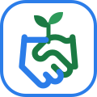

# ThriveTogether — team_16_application

**Build your business, not alone.**

The logo is two hands shaking (community, swapping skills) with a sprout growing from them (thriving). The blue and green match the app's Today and Planner colours. See [`logo.svg`](logo.svg).

Many autistic and ADHD (AuADHD) people leave traditional jobs even though they are highly skilled. Interviews, rigid deadlines and doing everything alone make self-employment hard too. ThriveTogether is a community app where neurodivergent entrepreneurs can:

- **Swap skills.** Trade what you are good at for what you find hard, either skill-for-skill or with time credits (1 hour of help = 1 credit).
- **Plan by energy, not willpower.** Break tasks into small steps, check in on your energy, and see *one* next step at a time. Deadlines get a built-in buffer.
- **Co-work (body doubling).** Join short sessions where people work side by side. Silent, text-only and camera-optional formats are available.
- **Show your work, not your interview skills.** Profiles focus on a portfolio and a "how I like to work" card.

## Run it

It needs [Node.js](https://nodejs.org) 18 or newer and has no dependencies to install.

```bash
npm start
```

Then open http://localhost:5173.

All data is stored in the browser (`localStorage`). The community members and sessions are **fictional seed data** for the prototype. Use *Comfort settings → Start over* to reset them.

## Screens

| Route | What it does |
|---|---|
| `#/today` | Energy check-in, the single next step (Done / Not now / Focus), upcoming soft deadlines, joined sessions, swap requests |
| `#/plan` | Add tasks with templates (invoice, proposal, bookkeeping…), steps, energy level, buffered deadlines, undo on delete |
| `#/focus/:id` | One step on screen at a time, "this step is too big" splitter, silent optional timer |
| `#/swap` | Matches based on your needs, search/filter, structured request dialog with "write a message for me", polite pre-written decline replies, time credits |
| `#/cowork` | Body-doubling sessions with clear formats, "no talking needed" filter, host a session, add to calendar (.ics) |
| `#/profile` | Offers/needs, communication preferences, portfolio, live preview |
| `#/settings` | Theme (calm light, calm dark, high contrast), text size, font (Atkinson Hyperlegible / Verdana / system), spacing, motion, low-stimulation mode, deadline buffer, data export/reset |

## Accessibility and neuro-inclusive design decisions

- **Clear colour coding:** each area has one colour that is always used the same way: Today is blue, Planner green, Skill swap orange, Co-work purple, Profile teal and Settings slate. Buttons for actions are always the same blue, so they are predictable.
- **Big icons and big text:** large icons on the navigation, page titles, headings, buttons and energy levels (defined in `js/icons.js`, always paired with a text label). Default text is 19px with near-black text on white, 2px borders and buttons at least 52px tall.
- **Sensory control:** muted colour palettes, high-contrast theme, low-stimulation mode, no animations beyond subtle hover changes, and none at all with reduced motion.
- **No time pressure:** messages never disappear on a timer, there are no streaks, and nothing says you are "late". The focus timer is silent and optional.
- **Reduce decisions:** you see one next step, not a wall of tasks. Templates remove the blank-page problem.
- **Literal, plain language:** short sentences, no idioms, and what happens next is always stated ("No one is notified").
- **Social scripts:** request messages can be generated, decline replies are pre-written, and everyone's communication preferences are shown *before* you write to them.
- **Undo instead of "Are you sure?"** for most destructive actions.
- **Keyboard and screen reader:** skip link, landmarks, one `h1` per page with focus moved to it on navigation, labelled form fields with inline error messages, `aria-live` announcements for every action, native `<dialog>` for modals, 44px minimum targets, and visible focus outlines.
- **Responsive** down to 320px wide, with no hidden hamburger menu.

## Project structure

```
index.html          App shell (header, nav, main, live region)
server.js           Zero-dependency static server
css/styles.css      Design tokens, themes, components
js/app.js           Hash router, focus management
js/store.js         State, seed data, persistence, matching logic
js/ui.js            Announcements, undo toasts, applying comfort settings
js/util.js          Escaping, dates, shared vocabularies
js/views/*.js       One file per screen: render() returns HTML, mount() wires events
```

## Next steps (not built yet)

- Real accounts and a backend (for example Supabase or Firebase) so swaps, messages and sessions are shared between people
- In-app messaging that respects each person's preferences (async by default, voice notes)
- Video/text rooms for co-work sessions, or integration with an existing tool
- Moderation, reporting and a community code of conduct
- Accountability buddies: pair two people for weekly check-ins
- Test with AuADHD entrepreneurs, plus an automated accessibility audit (axe) and a screen reader pass (NVDA, VoiceOver)
